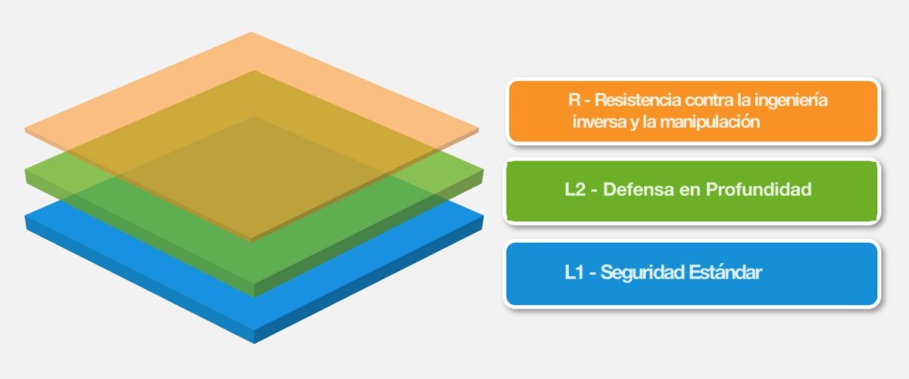

# Estándar de Verificación de Seguridad de Aplicaciones Móviles

El MASVS se puede utilizar para establecer un nivel de confianza en la seguridad de las aplicaciones móviles. Los requerimientos fueron desarrollados con los siguientes objetivos en mente:

- Usar como una métrica - Para proporcionar un estándar de seguridad contra el cual las aplicaciones móviles existentes pueden ser comparadas por desarrolladores y los propietarios de las aplicaciones;
- Utilizar como guía - Proporcionar una guía durante todas las fases del desarrollo y prueba de las aplicaciones móviles;
- Usar durante la contratación - Proporcionar una línea de base para la verificación de seguridad de aplicaciones móviles.

## Modelo de seguridad para una aplicación móvil

El MASVS define dos niveles de verificación de seguridad (MASVS-L1 y MASVS-L2), así como un conjunto de requisitos de resistencia a la ingeniería inversa (MASVS-R). El nivel MASVS-L1 contiene requerimientos genéricos de seguridad recomendados para todas las aplicaciones móviles, mientras que el MASVS-L2 debería aplicarse a aplicaciones que manejan datos altamente sensibles. MASVS-R cubre los controles de seguridad adicionales que se pueden aplicar si la prevención de las amenazas del lado del cliente es un objetivo de diseño.

Cumplir con los requerimientos de MASVS-L1 resulta en una aplicación segura que sigue las mejores prácticas de seguridad y no sufre de las vulnerabilidades más comunes. MASVS-L2 añade controles adicionales de defensa en profundidad, como la fijación de certificados SSL, lo que resulta en una aplicación resistente a ataques más sofisticados, asumiendo que los controles de seguridad del sistema operativo móvil estén intactos y que el usuario final no sea visto como un adversario potencial. El cumplimiento de todos o de un subconjunto de los requerimientos de protección del software en el nivel MASVS-R ayuda a impedir amenazas específicas del lado del cliente cuando el usuario final es considerado malicioso y/o el sistema operativo móvil está comprometido.

**I: Recomendamos implementar los controles MASVS-L1 en cualquier aplicación. Sin embargo, el implementar o no, uno o varios de los controles, debería ser una decisión basada en riesgo, la cual será claramente comunicada o tomada directamente junto con la empresa responsable.**

**II: Los controles de protección de software listados en MASVS-R y descritos en la MSTG pueden ser eludidos y no deben nunca reemplazar los demás controles de seguridad. Al contrario, su intención es añadir controles de protección adicionales, específicos a ciertas amenazas, a las apps que ya de por sí cumplen los requerimientos MASVS-L1 y/o MASVS-L2.**

### Estructura del documento

La primera parte del MASVS contiene una descripción del modelo de seguridad y de los niveles de verificación disponibles, seguido de recomendaciones sobre cómo utilizar el estándar en la práctica. En la segunda parte se detallan los requisitos de seguridad, junto con un mapeo a los distintos niveles de verificación. Los requerimientos se han agrupado en ocho categorías (V1 a V8) basadas en el objetivo/alcance técnico. La siguiente nomenclatura se utiliza a lo largo del MASVS y el MSTG:

- *Categoría de los requerimientos:* MASVS-Vx, ej. MASVS-V2: Almacenamiento de datos y privacidad.
- *Requerimiento:* MASVS-Vx.y, ej. MASVS-V2.2:"No se escribe ningún dato sensible en los registros de la aplicación".

### Niveles de verificación detallados

#### MASVS-L1: Seguridad Estándar

Una aplicación móvil que logra el nivel MASVS-L1 se adhiera a las mejores prácticas de seguridad en aplicaciones móviles. Cumple con los requerimientos básicos en términos de calidad de código, manejo de los datos sensibles e interacción con el entorno móvil. Debe existir un proceso de pruebas para verificar los controles de seguridad. Este nivel es apropiado para todas las aplicaciones móviles.

#### MASVS-L2: Defensa en Profundidad

MASVS-L2 introduce controles de seguridad avanzados que van más allá de los requisitos estándar. Para cumplir con MASVS-L2, debe existir un modelo de amenazas y la seguridad debe ser una parte fundamental de la arquitectura y el diseño de la app. Tomando ese modelo de amenazas como base, deben de seleccionarse e implementarse los controles MASVS-L2 que correspondan. Este nivel es apropiado para aplicaciones que manejan datos altamente sensibles, como las aplicaciones de banca móvil.

#### MASVS-R: Resistencia contra la ingeniería inversa y la manipulación

La aplicación cuenta con el nivel de seguridad específico para la aplicación y también es resistente a ataques específicos y claramente definidos en el lado del cliente, como alteración, modificación o ingeniería inversa para extraer código o datos sensibles. Esta aplicación aprovecha las características de seguridad del hardware o bien técnicas de protección de software suficientemente fuertes y verificables. MASVS-R es adecuado para las aplicaciones que manejan datos altamente confidenciales y puede servir como medio para proteger la propiedad intelectual o la manipulación de una aplicación.

### Uso recomendado

Las aplicaciones pueden ser verificadas contra el nivel MASVS L1 o L2 de acuerdo con la evaluación previa del riesgo y el nivel general de seguridad requerido. L1 es aplicable a todas las aplicaciones móviles, mientras que L2 se recomienda generalmente para las aplicaciones que manejan datos y/o funciones sensibles. MASVS-R (o partes de él) puede aplicarse para verificar la resistencia frente a amenazas específicas, como el reempaquetado o la extracción de datos sensibles, *además* de una verificación de seguridad adecuada.

En resumen, están disponibles los siguientes tipos de verificación:

- MASVS-L1
- MASVS-L1+R
- MASVS-L2
- MASVS-L2+R

Las diferentes combinaciones reflejan diferentes grados de seguridad y resistencia. El objetivo es permitir la flexibilidad: Por ejemplo, un juego móvil puede no requerir controles de seguridad del MASVS-L2, como la autenticación de 2 factores por razones de usabilidad, pero seguramente deba prevenir la manipulación del código por razones del negocio.

#### Cómo Elegir el Tipo de Verificación

La implementación de los requisitos del nivel MASVS L2 aumenta la seguridad, mientras que al mismo tiempo aumenta el costo de desarrollo y potencialmente empeora la experiencia del usuario final (el compromiso clásico). En general, L2 debe utilizarse para aplicaciones siempre que tenga sentido desde el punto de vista del riesgo contra el costo que conlleva (es decir, cuando la potencial pérdida causada por un compromiso de confidencialidad o integridad sea superior al costo que suponen los controles de seguridad adicionales). Una evaluación del riesgo debe ser el primer paso antes de aplicar el MASVS.

##### Ejemplos

###### MASVS-L1

- Todas las aplicaciones móviles. El nivel MASVS-L1 enumera las mejores prácticas de seguridad que se pueden seguir con un impacto razonable en el costo de desarrollo y la experiencia del usuario. Aplique los requerimientos de MASVS-L1 para cualquier aplicación que no califique para uno de los niveles superiores.

###### MASVS-L2

- Industria de la Salud: Aplicaciones móviles que almacenan información personal identificable que puede ser utilizada para el robo de identidad, pagos fraudulentos, o una variedad de esquemas de fraude. Para el sector de la salud en los Estados Unidos, las consideraciones de cumplimiento incluyen la Ley de Portabilidad y Responsabilidad del Seguro Médico (HIPAA, por sus siglas en inglés), Privacidad, Seguridad, Reglas de Notificación de Violación (Breach Notification Rules) y Reglas de Seguridad del Paciente (Patient Safety Rule).

- Sector Financiero: Aplicaciones que permiten el acceso a información altamente sensible como números de tarjetas de crédito, información personal o que permiten al usuario mover fondos. Estas aplicaciones deben tener controles de seguridad adicionales para prevenir el fraude. Las aplicaciones financieras necesitan asegurar el cumplimiento de las normas de seguridad de datos de la industria de tarjetas de pago (PCI DSS), Gramm Leech Bliley Act y Sarbanes-Oxley Act (SOX).

###### MASVS L1+R

- Aplicaciones móviles donde la protección de la dirección IP es un objetivo empresarial. Los controles de resistencia listados en MASVS-R se pueden utilizar para aumentar el esfuerzo necesario para obtener el código fuente original e impedir la manipulación / rotura.

- Industria de los juegos: Juegos con una necesidad esencial de evitar la posibilidad de modding y el engaño, como los juegos en línea competitivos. Hacer trampa es un tema importante en los juegos en línea, ya que una gran cantidad de tramposos conduce a un descontento de la base de jugadores y, en última instancia, puede causar que un juego falle. MASVS-R proporciona controles básicos contra la manipulación para ayudar a aumentar el esfuerzo de los tramposos.

###### MASVS L2+R

- Industria Financiera: Aplicaciones de banca móvil que permiten al usuario mover fondos, donde las técnicas de inyección de código e instrumentación en dispositivos comprometidos suponen un riesgo. En este caso, los controles del MASVS-R se pueden utilizar para impedir la manipulación de código, elevando la barra para los autores de malware.

- Todas las aplicaciones móviles que, por diseño, necesitan almacenar datos sensibles en el dispositivo móvil y, al mismo tiempo, deben soportar una amplia gama de dispositivos y versiones del sistema operativo. En este caso, los controles de resistencia pueden utilizarse como una medida de defensa en profundidad para aumentar el esfuerzo de los atacantes que intentan extraer los datos sensibles.

- Todas las aplicaciones que contengan "compras en la aplicación" deberían de proteger su contenido de pago utilizando idealmente controles MASVS-L2 y del lado del servidor. Sin embargo, puede haber casos en los que no sea posible implementar la proctección del lado del servidor. En esos casos, deberían de aplicarse los controles MASVS-R de forma adicional para incrementar el esfuerzo necesario para revertir o manipular la aplicación.
