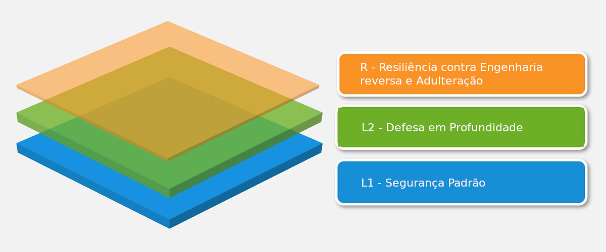

# O Padrão de Verificação de Segurança de Aplicativos Móveis

O MASVS pode ser utilizado para estabelecer um nível de confiança na segurança de aplicativos móveis. Os requisitos foram desenvolvidos com base nos seguintes objetivos:

- Utilize como uma métrica - Para fornecer um padrão de segurança que possa facilitar o comparativo entre aplicativos móveis atuais por desenvolvedores e proprietários de aplicativos.
- Utilize como orientação - Para fornecer orientação durante todas as fases do desenvolvimento e teste de aplicativos para dispositivos móveis.
- Utilize no processo de aquisição - Para fornecer uma linha de base para a verificação de segurança dos aplicativos móveis.

## Modelo de Segurança para um Aplicativo Móvel

O MASVS define dois níveis de verificação de segurança (MASVS-L1 e MASVS-L2), assim como um conjunto de requisitos de resiliência a engenharia reversa (MASVS-R). O MASVS-L1 contém requisitos básicos de segurança recomendados para todos os tipos de aplicativos para dispositivos móveis, enquanto o MASVS-L2 deve ser utilizado em aplicativos que manipulam dados altamente confidenciais. O MASVS-R abrange controles de proteção adicionais que podem ser aplicados se um dos objetivos do projeto for a prevenção de ameaças do lado do usuário.

Cumprir os requisitos do MASVS-L1 resulta em uma aplicação segura que segue as melhores práticas de segurança recomendadas e não sofre com vulnerabilidades mais comuns. O MASVS-L2 adiciona mais controles de defesa em profundidade como _SSL Pinning_, resultando em um aplicativo resistente a ataques mais complexos, assumindo que os controles de segurança do sistema operacional móvel estejam intactos e que o usuário não seja visto como um atacante em potencial. O cumprimento de todos ou de um subconjunto dos requisitos de proteção de _software_ no MASVS-R ajuda a mitigar ameaças específicas no lado do cliente quando o usuário final é malicioso e/ou o sistema operacional móvel esteja comprometido.

**I: Embora seja recomendado implementar controles MASVS-L1 em todos os aplicativos, a implementação ou não de um controle deve, em última opção, ser uma decisão tomada baseada em riscos e comunicada aos proprietários da empresa.**

**II: Observe que os controles de proteção de _software_ listados no MASVS-R e descritos no _OWASP Mobile Security Testing Guide_ podem ser ignorados e nunca devem ser usados como substitutos de controles adicionais de proteção e específicos para ameaças a aplicativos que também atendem aos requisitos do MASVS no MASVS-L1 ou MASVS-L2.**

### Estrutura do Documento

A primeira parte do MASVS contém uma descrição do modelo de segurança e os níveis de verificação disponíveis, seguidos de indicações sobre como usar o padrão na prática. Os requisitos de segurança detalhados, juntamente com um mapeamento para os níveis de verificação, estão listados na segunda parte. Os requisitos foram agrupados em oito categorias (V1 a V8) com base no objetivo/escopo técnico. A nomenclatura a seguir é usada em todo o MASVS e MSTG:

- *Categoria de Requisito:* MASVS-Vx, ex. MASVS-V2: Armazenamento de Dados e Privacidade.
- *Requisito:* MASVS-Vx.y, e.g. MASVS-V2.2: "Nenhum dado sensível é escrito nos _logs_ da aplicação.".

### Níveis de Verificação Detalhados

#### MASVS-L1: Padrão de Segurança

Um aplicativo móvel que alcança o MASVS-L1 adere às práticas recomendadas de segurança de aplicativos móveis. Ele preenche requisitos básicos em termos de qualidade de código, manuseio de dados confidenciais e interação com o ambiente móvel. Um processo de teste deve estar em vigor para verificar os controles de segurança. Este nível é apropriado para todas as aplicações móveis.

#### MASVS-L2: Defesa em Profundidade

O MASVS-L2 introduz controles avançados de segurança que vão além do requisito padrão. Para cumprir o MASVS-L2, um modelo de ameaça deve existir e a segurança deve ser parte integrante da arquitetura e do design do aplicativo. Com base no modelo de ameaça, os controles adequados do MASVS-L2 deveriam ter sido selecionados e implementados com sucesso. Este nível é apropriado para aplicativos que lidam com dados altamente sensíveis, como aplicativos bancários para dispositivos móveis.

#### MASVS-R: Resiliência contra Engenharia Reversa e Adulteração

O aplicativo tem segurança de última geração e também é resistente contra ataques específicos e claramente definidos do lado do usuário como adulteração, modificação ou engenharia reversa utilizados para extrair códigos ou dados confidenciais. Tal aplicativo aproveita dos recursos de segurança de _hardware_ ou técnicas de proteção de _software_ suficientemente fortes e verificáveis. O MASVS-R é aplicável a aplicativos que lidam com dados altamente confidenciais e pode servir como um meio de proteger a propriedade intelectual ou dificultar a adulteração de um aplicativo.

### Uso Recomendado

O nível de aderência dos aplicativos pode ser verificado no MASVS L1 ou L2 com base na avaliação prévia de risco e no nível total de segurança necessário. L1 é aplicável a todos os aplicativos móveis, enquanto L2 é geralmente recomendado para aplicativos que lidam com dados e/ou funcionalidades mais sensíveis. O MASVS-R (ou partes dele) pode ser aplicado para verificar a resiliência contra ameaças específicas como _repackaging_ ou extração de dados confidenciais, _além_ de uma verificação de segurança adequada.

Em resumo, os seguintes tipos de verificação estão disponíveis:

- MASVS-L1
- MASVS-L1+R
- MASVS-L2
- MASVS-L2+R

As diferentes combinações refletem diferentes graus de segurança e resiliência. O objetivo é permitir flexibilidade: por exemplo, um jogo desenvolvido para dispositivo móvel pode não justificar a inclusão de controles de segurança MASVS-L2 como autenticação de 2 fatores por razões de usabilidade, mas tem uma forte necessidade de negócios para prevenção de adulteração.

#### Qual Tipo de Verificação Escolher

A implementação dos requisitos do MASVS L2 aumenta a segurança, ao mesmo tempo em que aumenta o custo de desenvolvimento e potencialmente piora a experiência do usuário final (o _trade-off_ clássico). Em geral, o L2 deve ser usado para aplicativos sempre que fizer sentido a partir de uma perspectiva de risco versus custo (ou seja, onde a perda potencial causada por um compromisso de confidencialidade ou integridade é maior do que o custo incorrido pelos controles de segurança adicionais). Uma avaliação de risco deve ser o primeiro passo antes da aplicação do MASVS.

##### Exemplos

###### MASVS-L1

- Todos os aplicativos móveis. O MASVS-L1 lista práticas recomendadas de segurança que podem ser seguidas com um impacto razoável no custo de desenvolvimento e na experiência do usuário. Aplique os requisitos no MASVS-L1 para qualquer aplicativo que não se qualifique para um dos níveis mais altos.

<!-- \pagebreak -->

###### MASVS-L2

- Indústria de Saúde: Aplicativos móveis que armazenam informações pessoais identificáveis que podem ser usadas para roubo de identidade, pagamentos fraudulentos ou uma variedade de esquemas de fraude. Para o setor de saúde dos EUA, as considerações de conformidade incluem a Lei de Portabilidade e Responsabilização de Seguros de Saúde (HIPAA, em inglês), Privacidade, Segurança, Regras de Notificação de Violações e Regra de Segurança do Paciente.

- Indústria Financeira: Aplicativos que permitem o acesso a informações altamente sensíveis como números de cartão de crédito, informações pessoais ou permitem que o usuário mova fundos. Esses aplicativos garantem controles adicionais de segurança para evitar fraudes. Os aplicativos financeiros precisam garantir a conformidade com o Padrão de Segurança de Dados da Indústria de Cartões de Pagamento (PCI DSS), atos _Gramm Leech Bliley_ e _Sarbanes-Oxley (SOX)_.

###### MASVS L1+R

- Aplicativos móveis onde a proteção da Propriedade Intelectual (IP) é um objetivo comercial. Os controles de resiliência listados no MASVS-R podem ser usados para aumentar o esforço necessário para obter o código fonte original e para impedir a adultareão / _cracking_.

- Indústria de Jogos: Jogos com uma necessidade essencial para evitar modificações e trapaças, como jogos _online_ competitivos. Trapacear é uma questão importante nos jogos _online_, já que uma grande quantidade de usuários trapaceiros leva a uma base de jogadores descontentes e pode, em última instância, fazer com que um jogo perca usuários e acabe perdendo popularidade. O MASVS-R fornece controles básicos contra adulteração para ajudar a aumentar o esforço que os trapaceiros terão.

###### MASVS L2+R

- Indústria Financeira: Aplicativos bancários _online_ que permitem ao usuário movimentar fundos, onde técnicas como injeção de código e instrumentação em dispositivos comprometidos representam um risco. Nesse caso, os controles do MASVS-R podem ser usados para impedir a adulteração, aumentando a complexidade para desenvolvedores de _malware_.

- Todos os aplicativos móveis que por _design_ precisam armazenar dados confidenciais no dispositivo móvel e, ao mesmo tempo, devem suportar uma ampla gama de dispositivos e versões do sistema operacional. Nesse caso, os controles de resiliência podem ser usados como uma medida de defesa em profundidade para aumentar o esforço dos atacantes com o objetivo de extrair os dados confidenciais.

- Aplicativos que possuem compras no neles devem usar os controles do lado do servidor e do MASVS-L2 para proteger o conteúdo pago. No entanto, pode haver casos em que não há possibilidade de usar proteção do lado do servidor. Nesses casos, os controles MASVS-R devem ser aplicados adicionalmente, a fim de aumentar a dificuldade de realizar engenharia reversa e/ou adulteração.
