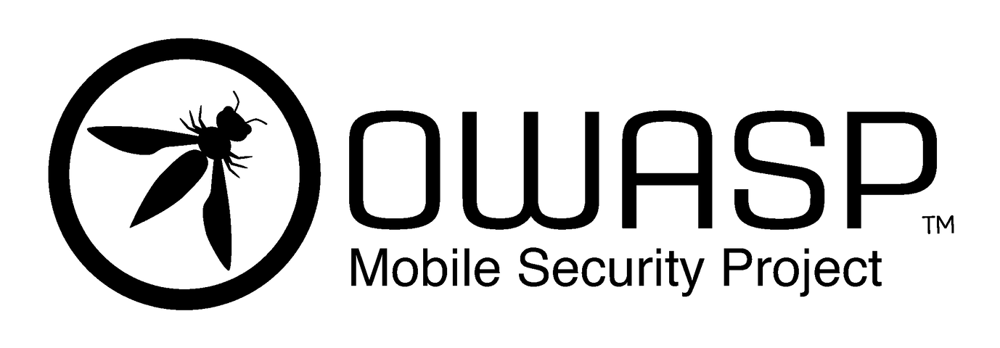
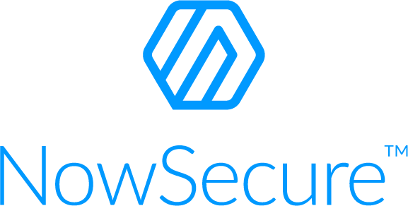

# About the Standard

Welcome to the Mobile Application Security Verification Standard (MASVS) 1.2. The MASVS is a community effort to establish a framework of security requirements needed to design, develop and test secure mobile apps on iOS and Android.

The MASVS is a culmination of community effort and industry feedback. We expect this standard to evolve over time and welcome feedback from the community.

The best way to get in contact with us is via the OWASP Mobile Project Slack channel: <https://owasp.slack.com/messages/project-mobile_omtg/details/> .

Accounts can be created at the following URL: [https://owasp.slack.com/join/shared_invite/zt-g398htpy-AZ40HOM1WUOZguJKbblqkw#/](https://owasp.slack.com/join/shared_invite/zt-g398htpy-AZ40HOM1WUOZguJKbblqkw#/).

## Copyright and License

Copyright © 2020 The OWASP Foundation.This work is licensed under a [Creative Commons Attribution-ShareAlike 4.0 International License](https://creativecommons.org/licenses/by-sa/4.0/). For any reuse or distribution, you must make clear to others the license terms of this work.

<!-- \pagebreak -->

## Acknowledgements

| Project Lead | Lead Author | Contributors and Reviewers
| ------- | --- | ----------------- |
| Sven Schleier, Jeroen Willemsen and Carlos Holguera | Bernhard Mueller | Alexander Antukh, Mesheryakov Aleksey, Bachevsky Artem, Jeroen Beckers, Vladislav Chelnokov, Ben Cheney, Peter Chi, Lex Chien, Stephen Corbiaux, Manuel Delgado, Ratchenko Denis, Ryan Dewhurst, Tereshin Dmitry, Christian Dong, Oprya Egor, Ben Gardiner, Rocco Gränitz, Henry Hu, Sjoerd Langkemper, Vinícius Henrique Marangoni, Martin Marsicano, Roberto Martelloni, Gall Maxim, Eugen Martynov, Riotaro Okada, Abhinav Sejpal, Stefaan Seys, Yogesh Sharma, Prabhant Singh, Sven Schleier, Nikhil Soni, Anant Shrivastava, Francesco Stillavato, Romuald Szkudlarek, Abderrahmane Aftahi, Abdessamad Temmar, Koki Takeyama, Chelnokov Vladislav, Leo Wang |

 

| Language | Translators & Reviewers |
| --- | ------------------------------ |
| Chinese (Traditonal) | Peter Chi, and Lex Chien, Henry Hu, Leo Wang |
| Chinese (Simplified) | Bob Peng, Harold Zang, Jack S |
| French | Romuald Szkudlarek, Abderrahmane Aftahi, Christian Dong (Review) |
| German | Rocco Gränitz, Sven Schleier (Review) |
| Hindi | Mukesh Sharma, Ritesh Kumar, Kunwar Atul Singh, Parag Dave, Devendra Kumar Sinha, Vikrant Shah |
| Japanese | Koki Takeyama, Riotaro Okada (Review) |
| Korean | Youngjae Jeon, Jeongwon Cho, Jiyou Han, Jiyeon Sung |
| Persian | Hamed Salimian, Ramin Atefinia, Dorna Azhirak, Bardiya Akbari, Mahsa Omidvar, Alireza Mazhari, Milad Khoshdel |
| Russian | Gall Maxim, Eugen Martynov, Chelnokov Vladislav (Review), Oprya Egor (Review), Tereshin Dmitry (Review) |
| Spanish | Martin Marsicano, Carlos Holguera |

This document started as a fork of the OWASP Application Security Verification Standard written by Jim Manico.

## Sponsors

While both the MASVS and the MSTG are created and maintained by the community on a voluntary basis, sometimes a little bit of outside help is required. We therefore thank our sponsors for providing the funds to be able to hire technical editors. Note that their sponsorship does not influence the content of the MASVS or MSTG in any way. The sponsorship packages are described on the [OWASP Project Wiki](https://owasp.org/www-project-mobile-security-testing-guide/#div-sponsorship "OWASP Mobile Security Testing Guide Sponsorship Packages").

### Honourable Benefactor

### Good Samaritan Benefactor

Next, we would like to thank the OWASP Bay Area Chapter for their sponsorship. Last, we would like to thank everybody that bought the book from Leanpub and sponsored us that way.
