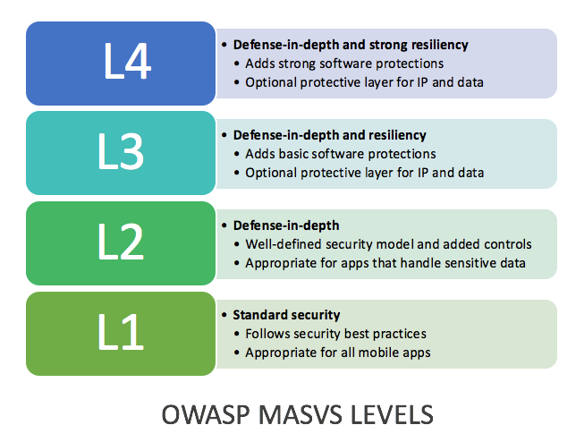

# Using the Mobile Application Security Verification Standard

The MASVS can be used to establish a level of confidence in the security of mobile apps. The requirements were developed with the following objectives in mind:

* Use as a metric - To provide application developers and application owners with a framework which allows to measure the security, and thus the degree of trust that can be placed in their mobile applications.
* Use as guidance - To provide guidance in regards to security controls necessary to implement and test in order to satisfy application security requirements
* Use during procurement - Provide a baseline for mobile app security verification requirements.

## Mobile Application Security Verification Levels

The Mobile Application Security Verification Standard defines four security verification levels, with each level increasing in depth. Fulfilling the requirements in L1 results in a secure app that handles sensitive data appropriately and doesn't suffer from common vulnerabilities. L2 adds additional controls, resulting in an app that is resilient against sophisticated attacks. L3 and L4 add further protections that make an application more resilient against reverse engineering. 

An app that is compliant to the requirements in L2 can be considered *highly secure*, in that it follows security best practices that are considered state-of-the-art. L3-L4 are useful in cases where tampering with the app poses a serious risk, or an additional layer of protection for sensitive data or the intellectual property is desired.

### Level 1: Standard Security

An application that achieves MASVS level 1 adheres to mobile application security best practices. It fulfills basic requirements in terms of code quality, handling of sensitive data, and interaction with the mobile environment. A testing process must be in place to verify the security controls. This level is appropriate for all mobile applications.

### Level 2: Defense-in-Depth

Level 2 introduces advanced security controls that go beyond the standard requirements. To fulfill L2, a threat model must exist, and security must be considered during the design phase. The effectiveness of the controls must be verified using white-box testing. This level is appropriate for applications that handle sensitive data, such as mobile banking.

### Level 3: Defense-in-Depth and Resiliency

Level 3 adds mechanisms that increase the cost of reverse engineering the application. It can be applied to add an additional layer of protection for apps that process sensitive data. Vendors may also opt to implement the L3 requirements as a means of protecting their intellectual property and to prevent tampering with the app.

### Level 4: Defense-in-Depth and Strong Resiliency

An application that achieves MASVS level 4 has both state-of-the-art security and strong software protections. Such an application is highly resilient against attacks and reverse engineering attempts. L4 is applicable to apps that handle highly sensitive data. The L4 controls may also serve as a means of protecting intellectual property or tamper-proofing an app.

## How to use this standard

One of the best ways to use the Mobile Application Security Verification Standard is to use it as blueprint to create a secure coding checklist specific to your application, platform or organization. Tailoring the MASVS to your use cases will increase the focus on the security requirements that are most important to your projects and environments.

## Applying MASVS in Practice

Different threats have different motivations. Some industries have unique information and technology assets and domain specific regulatory compliance requirements.

Below we provide industry-specific guidance regarding recommended MASVS levels. Although some unique criteria and some differences in threats exist for each industry, a common theme throughout all industry segments is that opportunistic attackers will look for any easily exploitable vulnerable applications, which is why MASVS L1 is recommended for all applications regardless of industry. L2 and higher are recommended where compromising an app grants access to highly sensitive data or functionality. The following tables shows how the levels are intended to be used.

| Industry | Threat Profile | L2 Recommendation | L3+ Recommendation |
| --- | --- | --- | --- | --- |
| Finance and Insurance | Although this segment will experience attempts from opportunistic attackers, it is often viewed as a high value target by motivated attackers and attacks are often financially motivated. Commonly, attackers are looking for sensitive data or account credentials that can be used to commit fraud or to benefit directly by leveraging money movement functionality built into applications. Techniques often include stolen credentials, application-level attacks, and social engineering. Some major compliance considerations include Payment Card Industry Data Security Standard (PCI DSS), Gramm Leech Bliley Act and Sarbanes-Oxley Act (SOX). | Apps that enable access to highly sensitive information like credit card numbers, personal information, or that can move limited amounts of money in limited ways. Examples include: (i) transfer money between accounts at the same institution or(ii) a slower form of money movement (e.g. ACH) with transaction limits or(iii) wire transfers with hard transfer limits within a period of time. | Apps that enable access to large amounts of sensitive information or that allow either rapid transfer of large sums of money (e.g. wire transfers) and/or transfer of large sums of money in the form of individual transactions or as a batch of smaller transfers. |
| Healthcare | Most attackers are looking for sensitive data that can be used to directly or indirectly profit from to include personally identifiable information and payment data. Often the data can be used for identity theft, fraudulent payments, or a variety of fraud schemes. For the US healthcare sector, the Health Insurance Portability and Accountability Act (HIPAA) Privacy, Security, Breach Notification Rules and Patient Safety Rule. | Apps that enable access to sensitive medical information (Protected Health Information), Personally Identifiable Information, or payment data. | Apps used to control medical equipment, devices, or records that may endanger human life. Payment and Point of Sale systems (POS) that contain large amounts of transaction data that could be used to commit fraud. 
| Gaming | Cheating is an important issue in online games, as a large amount of cheaters leads to a disgruntled the player base and can ultimately cause a game to fail. Popular games usually result in a modding scene that releases patched versions of games that enable features such as infinite in-game currency, threatening the business model on which the game is built. | Online games that use a client-server infrastructure where cheating is a potential issue. Games that process personally identifiable information or sensitive data, such as credit card information.| Games with an essential need to prevent modding and cheating, such as competitive online games.
| Manufacturing, professional, transportation, technology, utilities, infrastructure, and defense | BYOD exposes sensitive corporate data in ways that are difficult to control. Lost or compromised mobile devices may grant adversaries access to intellectual property or application functionality that could influence or disrupt sensitive systems. Data obtained from devices may be used for identity theft, fraudulent payments, or a variety of fraud schemes. To mitigate this threat, it is often desirable to employ containerization solutions that improve in an untrusted environment. | Apps that enable access to internal information or information about employees that may be leveraged in social engineering. Apps that enable access to intellectual property or trade secrets.| Apps that enable access to highly sensitive intellectual property, trade secrets, or government secrets (e.g. in the United States this may be anything classified at Secret or above) that is critical to the survival or success of the organization. Applications controlling sensitive functionality (e.g. transit, manufacturing equipment, control systems) where tampering could threaten safety of life.
