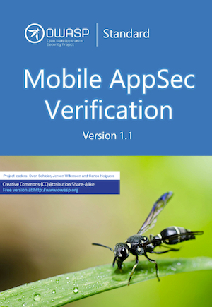

<a href="https://github.com/OWASP/owasp-masvs/releases/download/v1.2/OWASP_MASVS-v1.2-en.pdf"></a>

# OWASP Mobile Application Security Verification Standard [](https://twitter.com/OWASP_MSTG)

[](https://creativecommons.org/licenses/by-sa/4.0/ "CC BY-SA 4.0")
[](https://owasp.org/projects/)
[](https://github.com/OWASP/owasp-masvs/actions?query=workflow%3A%22CI+Build%22)
[](https://github.com/OWASP/owasp-masvs/actions?query=workflow%3A%22Check+Markdown+markup%22)
[](https://github.com/OWASP/owasp-masvs/actions?query=workflow%3A%22Check+Markdown+Links%22)

This is the official Github Repository of the OWASP Mobile Application Security Verification Standard (MASVS). The MASVS establishes baseline security requirements for mobile apps that are useful in many scenarios, including:

- In the SDLC - to establish security requirements to be followed by solution architects and developers;
- In mobile app penetration tests - to ensure completeness and consistency in mobile app penetration tests;
- In procurement - as a measuring stick for mobile app security, e.g. in form of questionnaire for vendors;
- Et cetera.

The MASVS is a sister project of the [OWASP Mobile Security Testing Guide](https://github.com/OWASP/owasp-mstg "OWASP Mobile Security Testing Guide").

# Getting the MASVS

PDF/Mobi/Epub/Docx downloads are available on the [Releases page](https://github.com/OWASP/owasp-masvs/releases "Releases"). The documents were created by using [pandocker](https://github.com/dalibo/pandocker/ "pandocker").

The current release of the [MASVS is version 1.2](https://github.com/OWASP/owasp-masvs/releases/tag/v1.2 "MASVS version 1.2"). Want to have the latest `snapshot` version? Check [the latest Github build action](https://github.com/OWASP/owasp-masvs/actions?query=workflow%3A%22Document+Build%22). The MASVS is also available in different languages:

- [Brazilian Portuguese](https://github.com/OWASP/owasp-masvs/tree/master/Document-ptbr "Brazilian Portuguese")
- [Chinese (Simplified) - ZHCN](https://github.com/OWASP/owasp-masvs/tree/master/Document-zhcn "Simplified Chinese (ZHCN)")
- [Chinese (Traditional) - ZHTW](https://github.com/OWASP/owasp-masvs/tree/master/Document-zhtw "Traditional Chinese (ZHTW)")
- [English](https://github.com/OWASP/owasp-masvs/tree/master/Document "English")
- [French](https://github.com/OWASP/owasp-masvs/tree/master/Document-fr "French")
- [German](https://github.com/OWASP/owasp-masvs/tree/master/Document-de "German")
- [Hindi (in progress)](https://github.com/OWASP/owasp-masvs/tree/master/Document-hi "Hindi")
- [Japanese](https://github.com/OWASP/owasp-masvs/tree/master/Document-ja "Japanese")
- [Korean](https://github.com/OWASP/owasp-masvs/tree/master/Document-ko "Korean")
- [Persian](https://github.com/OWASP/owasp-masvs/tree/master/Document-fa "Persian")
- [Portuguese](https://github.com/OWASP/owasp-masvs/tree/master/Document-ptpt "Portuguese")
- [Russian](https://github.com/OWASP/owasp-masvs/tree/master/Document-ru "Russian")
- [Spanish](https://github.com/OWASP/owasp-masvs/tree/master/Document-es "Spanish")  

## Gitbook

Read the English version on [Gitbook](https://mobile-security.gitbook.io/masvs/ "GitBook Mobile AppSec Verification Standard"). The book is automatically synchronized with the main repo.

## Create new PDF, Epub, Mobi, and Word document

You can find the documents in the release page. If you want to generate the documents yourself, execute the following steps. Clone the repository and run the document generator. This produces PDF, Epub and Docx files in the root of the project.

```shell
$ git clone https://github.com/OWASP/owasp-masvs/
$ cd owasp-masvs/tools/docker
$ ./run_docker_masvs_generation_on_local.sh LATEST
```

## Exporting to JSON, XML and CSV

The repository contains a Python tool for converting the requirements into various formats. Clone the repo and run `export.py` from the tools folder.

```shell
export.py [-h] [--format {json,xml,csv}] [--lang {es/ru/en/fr/de/zhtw/ja}]
```

## Suggestions and Feedback

To report and error or suggest an improvement, please create an [issue](https://github.com/OWASP/owasp-masvs/issues "Github issues") or create a Pull Request.

# How to Contribute

The MASVS is an open source effort and we welcome contributions and feedback. If you want to contribute additional content, or improve existing content, we suggest that you first contact us on the OWASP MSTG Slack channel:

<https://owasp.slack.com/messages/project-mobile_omtg/details/>

You can sign up here:

[https://owasp.slack.com/join/shared_invite/zt-g398htpy-AZ40HOM1WUOZguJKbblqkw#/](https://owasp.slack.com/join/shared_invite/zt-g398htpy-AZ40HOM1WUOZguJKbblqkw#/)

Before you start contributing, please check our [contribution guide](https://github.com/OWASP/owasp-masvs/blob/master/CONTRIBUTING.md "Contribution Guide") which should get you started.

# Read Individual Sections of the MASVS Here

- [Foreword](Document/0x01-Foreword.md)
- [Frontispiece](Document/0x02-Frontispiece.md)
- [The Mobile Application Security Verification Standard](Document/0x03-Using_the_MASVS.md)
- [Assessment and Verification](Document/0x04-Assessment_and_Certification.md)
- [V1: Architecture, Design and Threat Modeling Requirements](Document/0x06-V1-Architecture_design_and_threat_modelling_requireme.md)
- [V2: Data Storage and Privacy Requirements](Document/0x07-V2-Data_Storage_and_Privacy_requirements.md)
- [V3: Cryptography Requirements](Document/0x08-V3-Cryptography_Verification_Requirements.md)
- [V4: Authentication and Session Management Requirements](Document/0x09-V4-Authentication_and_Session_Management_Requirements.md)
- [V5: Network Communication Requirements](Document/0x10-V5-Network_communication_requirements.md)
- [V6: Environmental Interaction Requirements](Document/0x11-V6-Interaction_with_the_environment.md)
- [V7: Code Quality and Build Setting Requirements](Document/0x12-V7-Code_quality_and_build_setting_requirements.md)
- [V8: Resiliency Against Reverse Engineering Requirements](Document/0x15-V8-Resiliency_Against_Reverse_Engineering_Requirements.md)
- [Appendix A: Glossary](Document/0x90-Appendix-A_Glossary.md)
- [Appendix B: References](Document/0x91-Appendix-B_References.md)
- [Release notes](CHANGELOG.md)
