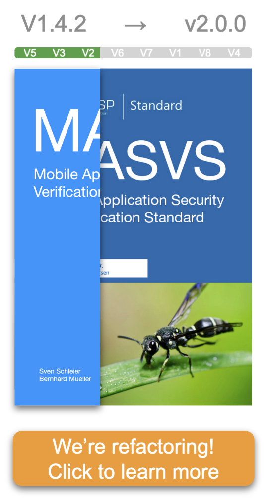

# OWASP Mobile Application Security Verification Standard (MASVS)

This is the official Github Repository of the OWASP Mobile Application Security Verification Standard (MASVS). The MASVS establishes baseline security requirements for mobile apps that are useful in many scenarios. You can use it:

- As a metric - To provide a security standard against which existing mobile apps can be compared by developers and application owners.
- As guidance - To provide guidance during all phases of mobile app development and testing.
- During procurement - To provide a baseline for mobile app security verification.

The MASVS is a sister project of the [OWASP Mobile Application Security Testing Guide](https://github.com/OWASP/owasp-mastg "OWASP Mobile Application Security Testing Guide").

 

- ⬇️ [Download the latest PDF](https://github.com/OWASP/owasp-masvs/releases/latest)
- ✅ [Get the latest Mobile App Security Checklists](https://github.com/OWASP/owasp-mastg/releases/latest)
- ⚡ [Contribute!](#how-to-contribute)
- 💥 [Play with our Crackmes](https://github.com/OWASP/owasp-mastg/blob/master/Crackmes/README.md)

## Trusted by ...

The OWASP MASVS and MASTG are trusted by the following platform providers and standardization, governmental and educational institutions. [Learn more](https://mas.owasp.org/MASTG/0x02b-MASVS-MASTG-Adoption/).

## 🥇 MAS Advocates

MAS Advocates are industry adopters of the OWASP MASVS and MASTG who have invested a significant and consistent amount of resources to push the project forward by providing consistent high-impact contributions and continuously spreading the word. [Learn more](https://mas.owasp.org/MASTG/0x02c-Acknowledgements).

 

  

## Connect with Us

<ul>
<li><a href="https://github.com/OWASP/owasp-masvs/discussions"> GitHub Discussions</a></li>
<li><a href="https://owasp.slack.com/messages/project-mobile_omtg/details/">  #project-mobile_omtg</a> (<a href="https://owasp.slack.com/join/shared_invite/zt-g398htpy-AZ40HOM1WUOZguJKbblqkw#//">Get Invitation</a>)</li>
<li><a href="https://twitter.com/OWASP_MAS"> @OWASP_MAS </a> (Official Account)</li>
<li><a href="https://twitter.com/bsd_daemon"> @bsd_daemon </a> (Sven Schleier, Project Lead) <a href="https://twitter.com/grepharder"> @grepharder </a> (Carlos Holguera, Project Lead)</li>
</ul>

## How to Contribute

The MASVS is an open source effort and we welcome all kinds of contributions and feedback.

**Help us improve & join our community:**

- 🐞 [Report an error (typos, grammar)](https://github.com/OWASP/owasp-masvs/issues) or [fix it on a Pull Request](https://github.com/OWASP/owasp-masvs/pulls).
- 💬 [Give feedback](https://github.com/OWASP/owasp-masvs/discussions/categories/general).
- 🙏 [Ask questions](https://github.com/OWASP/owasp-masvs/discussions/categories/q-a)

**Contribute with content:**

- 💡 [Propose ideas or suggest improvements](https://github.com/OWASP/owasp-masvs/discussions/categories/ideas) (if it qualifies we'll promote it to an [Issue](https://github.com/OWASP/owasp-masvs/issues "Github issues"))
- 📄 [Create a Pull Request](https://github.com/OWASP/owasp-masvs/pulls) for concrete fixes (e.g. grammar/typos) or content already approved by the core team.

Before you start contributing, please check our [contribution guide](https://github.com/OWASP/owasp-masvs/blob/master/CONTRIBUTING.md "Contribution Guide") which should get you started. If you have any doubts [please contact us](#connect-with-us).

## MASVS Translations

The MASVS is available in different languages:

- [Chinese (Simplified) - ZHCN](https://github.com/OWASP/owasp-masvs/tree/master/Document-zhcn "Simplified Chinese (ZHCN)")
- [Chinese (Traditional) - ZHTW](https://github.com/OWASP/owasp-masvs/tree/master/Document-zhtw "Traditional Chinese (ZHTW)")
- [English](https://github.com/OWASP/owasp-masvs/tree/master/Document "English")
- [French](https://github.com/OWASP/owasp-masvs/tree/master/Document-fr "French")
- [German](https://github.com/OWASP/owasp-masvs/tree/master/Document-de "German")
- [Hindi](https://github.com/OWASP/owasp-masvs/tree/master/Document-hi "Hindi")
- [Japanese](https://github.com/OWASP/owasp-masvs/tree/master/Document-ja "Japanese")
- [Korean](https://github.com/OWASP/owasp-masvs/tree/master/Document-ko "Korean")
- [Persian](https://github.com/OWASP/owasp-masvs/tree/master/Document-fa "Persian")
- [Portuguese (Brazil)](https://github.com/OWASP/owasp-masvs/tree/master/Document-ptbr "Brazilian Portuguese")
- [Portuguese (Portugal)](https://github.com/OWASP/owasp-masvs/tree/master/Document-ptpt "Portuguese Portugal")
- [Russian](https://github.com/OWASP/owasp-masvs/tree/master/Document-ru "Russian")
- [Spanish](https://github.com/OWASP/owasp-masvs/tree/master/Document-es "Spanish")

Coming soon:
- [Turkish](https://github.com/OWASP/owasp-masvs/pull/561)
- [Czech](https://github.com/OWASP/owasp-masvs/issues/622)
- [Greek](https://github.com/OWASP/owasp-masvs/issues/625)

> Your language is not here? [We'd love to add it!](tools/README.md#adding-another-language)

## Other Formats

See the [latest release](https://github.com/OWASP/owasp-masvs/releases/latest). Else you can export it yourself in [other formats](tools/README.md#other-formats).

## Table-of-Contents

- [Foreword](Document/0x01-Foreword.md)
- [Frontispiece](Document/0x02-Frontispiece.md)
- [The Mobile Application Security Verification Standard](Document/0x03-Using_the_MASVS.md)
- [Assessment and Verification](Document/0x04-Assessment_and_Certification.md)
- [V1: Architecture, Design and Threat Modeling Requirements](Document/0x06-V1-Architecture_design_and_threat_modelling_requireme.md)
- [V2: Data Storage and Privacy Requirements](Document/0x07-V2-Data_Storage_and_Privacy_requirements.md)
- [V3: Cryptography Requirements](Document/0x08-V3-Cryptography_Verification_Requirements.md)
- [V4: Authentication and Session Management Requirements](Document/0x09-V4-Authentication_and_Session_Management_Requirements.md)
- [V5: Network Communication Requirements](Document/0x10-V5-Network_communication_requirements.md)
- [V6: Environmental Interaction Requirements](Document/0x11-V6-Interaction_with_the_environment.md)
- [V7: Code Quality and Build Setting Requirements](Document/0x12-V7-Code_quality_and_build_setting_requirements.md)
- [V8: Resiliency Against Reverse Engineering Requirements](Document/0x15-V8-Resiliency_Against_Reverse_Engineering_Requirements.md)
- [Appendix A: Glossary](Document/0x90-Appendix-A_Glossary.md)
- [Appendix B: References](Document/0x91-Appendix-B_References.md)
- [Release notes](CHANGELOG.md)
