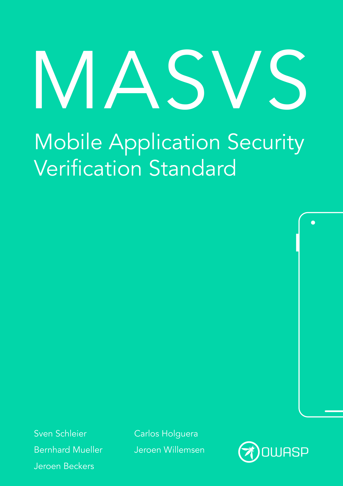
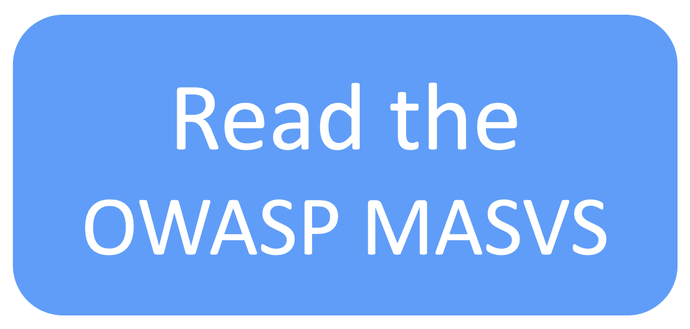

# OWASP Mobile Application Security Verification Standard (MASVS)

The **OWASP Mobile Application Security Verification Standard (MASVS)** establishes baseline security and privacy requirements for mobile apps that are broken down in the the [OWASP Mobile Security Weakness Enumeration (MASWE)](https://github.com/OWASP/maswe) and tested in the [OWASP Mobile Application Security Testing Guide](https://github.com/OWASP/mastg). You can use it:

- As a metric - To provide a security standard against which existing mobile apps can be compared by developers and application owners.
- As guidance - To provide guidance during all phases of mobile app development and testing.
- During procurement - To provide a baseline for mobile app security verification.

> [OWASP MAS](https://mas.owasp.org): [OWASP MASVS](https://mas.owasp.org/MASVS) ➡ [OWASP MASWE](https://mas.owasp.org/MASWE) ➡ [OWASP MASTG](https://mas.owasp.org/MASTG)

 

 

- 🌐 [Access the MASVS Web](https://mas.owasp.org/MASVS/)
- ⬇️ [Download the latest PDF](https://github.com/OWASP/masvs/releases/latest)
- ✅ [Get the latest Mobile App Security Checklists](https://github.com/OWASP/mastg/releases/latest)
- ⚡ [Contribute!](https://mas.owasp.org/contributing)
- 💥 [Play with our Crackmes](https://mas.owasp.org/crackmes)
- 📞 [Contact Us](https://mas.owasp.org/contact)

## Trusted by

The OWASP MASVS, MASWE and MASTG are trusted by the following platform providers and standardization, governmental and educational institutions. [Learn more](https://mas.owasp.org/MASTG/0x02b-MASVS-MASTG-Adoption/).

## 🥇 MAS Advocates

MAS Advocates are industry adopters of the OWASP MASVS, MASWE and MASTG who have invested a significant and consistent amount of resources to push the project forward by providing consistent high-impact contributions and continuously spreading the word. [Learn more](https://mas.owasp.org/MASTG/0x02c-Acknowledgements).

 

  

8